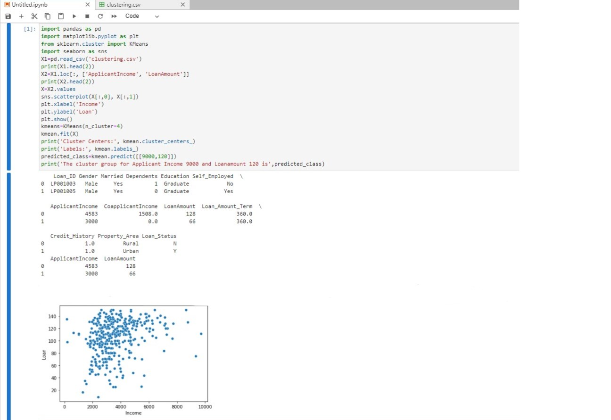

# Implementation of K-Means Clustering Algorithm
## Aim
To write a python program to implement K-Means Clustering Algorithm.
## Equipment’s required:
1.	Hardware – PCs
2.	Anaconda – Python 3.7 Installation

## Algorithm:

### Step1:
Import the necessary packages using import statement.

### Step2:
Read the given csv file using read_csv() method and print the number of contents to be displayed using df.head().

### Step3
Plot a graph for the applicant income vs loan amount lot using sns.scatterplot.

### Step4
Obtain the kmeam clustering, display the clusters using .cluster_centers_ and the labels using .labels_ .

### Step5
Predict the k means using kmean.predict() method and display the result.

## Program:
```
import pandas as pd
import matplotlib.pyplot as plt
from sklearn.cluster import KMeans
import seaborn as sns
X1=pd.read_csv('clustering.csv')
print(X1.head(2))
X2=X1.loc[:, ['ApplicantIncome', 'LoanAmount']]
print(X2.head(2))
X=X2.values
sns.scatterplot(X[:,0], X[:,1])
plt.xlabel('Income')
plt.ylabel('Loan')
plt.show()
kmeans=KMeans(n_cluster=4)
kmean.fit(X)
print('Cluster Centers:', kmean.cluster_centers_)
print('Labels:', kmean.labels_)
predicted_class=kmean.predict([[9000,120]])
print('The cluster group for Applicant Income 9000 and Loanamount 120 is',predicted_class)
```
## Output:

## Result
Thus the K-means clustering algorithm is implemented and predicted the cluster class using python program.